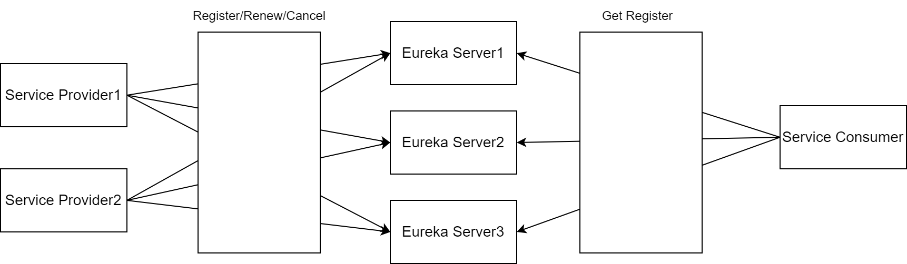

# Eureka

使用 **Spring Cloud** 和 **Eureka** 实现一个微服务架构，包括服务中心集群、服务提供者集群以及服务消费者的实现。通过本例，您将学习到如何配置和使用Eureka进行服务注册与发现。

我们将实现1个服务中心集群，1个服务提供者集群以及1个服务消费者的架构；通过服务中心Eureka来进行服务治理，服务消费者调用服务提供者的服务。我们的架构由以下几部分组成：

- **服务中心集群**（Eureka Server）
- **服务提供者集群**（Eureka Client）
- **服务消费者**（使用Feign进行调用）

